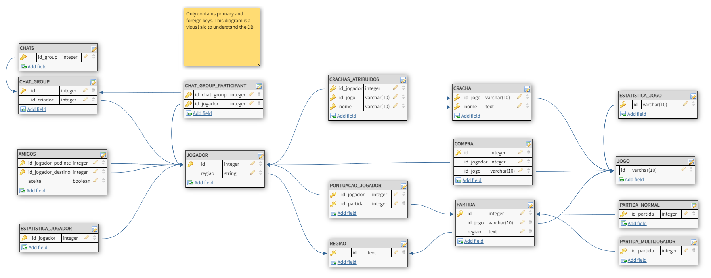
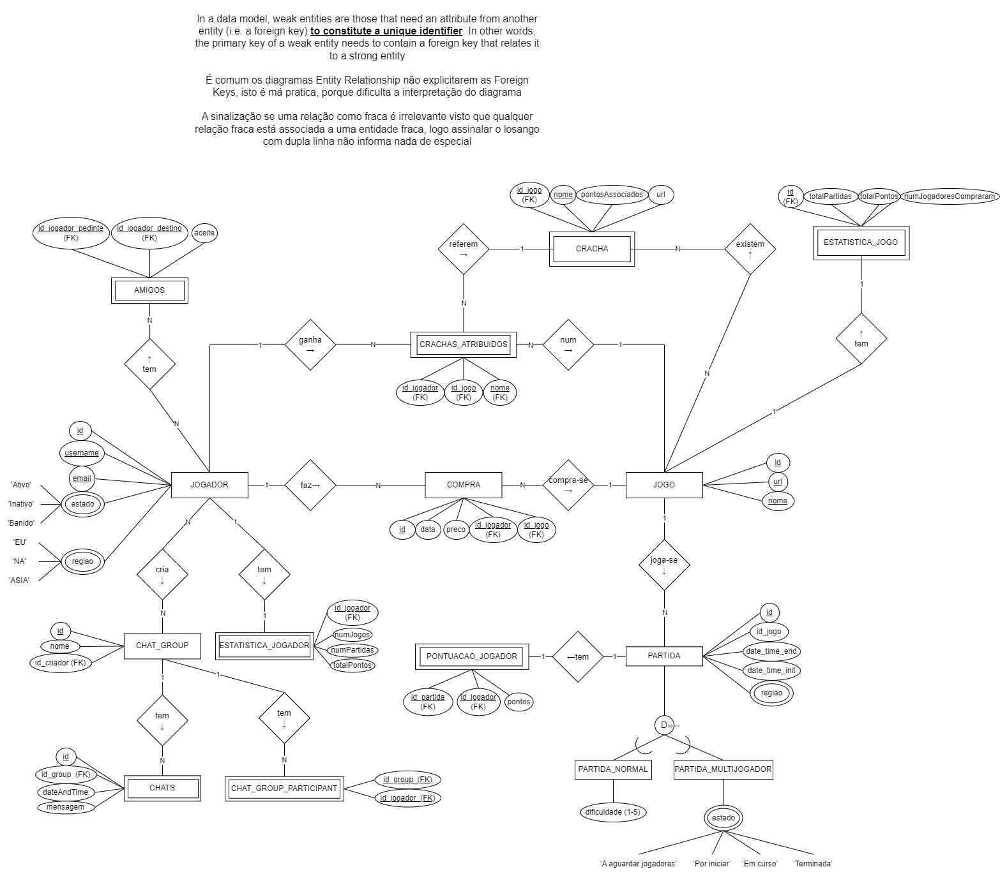

## About
- Scripts to create a manageable database for a generic game & a JPA console app for it
- Not a fan of this curricular unit or this assignment, but it is what it is. I didn't refine it. There's a mix between portuguese and english terms in the code
- Assignment done for the subject Systems of Information in the summer of 2023

> [!IMPORTANT]  
> The way the assignment is described is confusing, the professors do this on purpose

## Assignment description paper (translated)

The company “GameOn” intends to develop a system to manage games, players and matches
that they do. The system must record the data of players who are identified by an ID
generated by the system, also having the email and username as unique and mandatory values. O
player takes one of the states 'Active', 'Inactive' or 'Banned' and belongs to a certain region.
For each region, only its name must be registered. The games have as an identifier a
alphanumeric reference of dimension 10, a mandatory and unique name and a url to a page
with game details. 

It is interesting to register the players who purchased a specific game, the date and
the price associated with the purchase. Each time the game is played, a match is created with a number
sequential and unique for each game, and the start and end dates and times of the game must be saved.
match. The game can be normal with just one player, or multi-player. Normal matches
must have information about the degree of difficulty (value from 1 to 5) and be associated with the player who
plays them and the score he obtained. Multiplayer matches must be associated with
players who play them and it is necessary to save the scores obtained by each player in each game.
They must also contain information about the state they are in, which can take the values
‘To be started’, ‘Waiting for players’, ‘In progress’ and ‘Finished’. 

The existence of a system is assumed
which updates the score and status while the game is running. Each match is associated with a
region and only players from that region can play it. In order to reward players, each
Game may have a set of badges that are awarded to players when a point threshold
in this game it is achieved. To do this, it is important to register the name of the badge, which is unique to each game, the
point limit and the url for the badge image. The
badges that are assigned to each player.

Statistics associated with players and games must exist in specific tables. Interest
record for each player, the number of games he played, the number of different games he played
played and the total points of all games and matches played. For each game it is important to register the
number of matches, number of players and total points.

Players can add other players as friends. Therefore, it is important to register this
friendship relationship. It is also possible to create a conversation between several players with a
system-generated identifier and a name. Associated with the conversation are messages with a
unique and sequential order number for each conversation that serves as an identifier, the date and time
of the message, the text and which player sent the message.